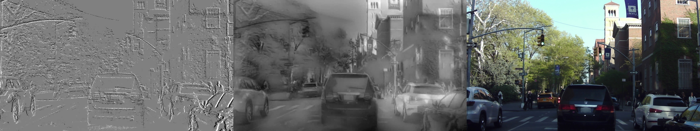
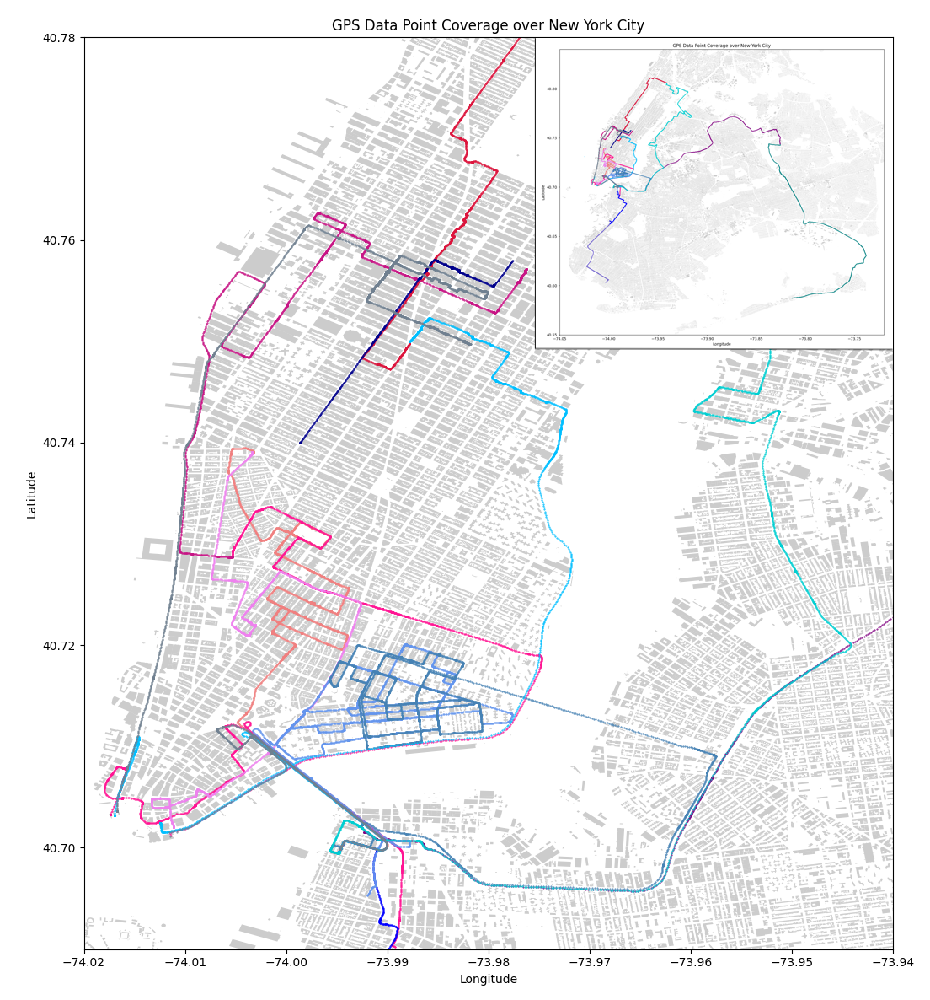
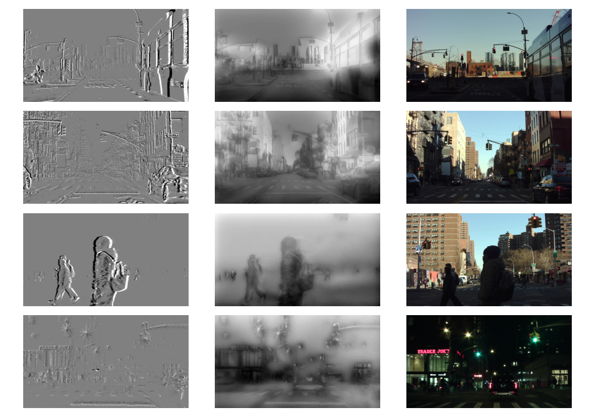
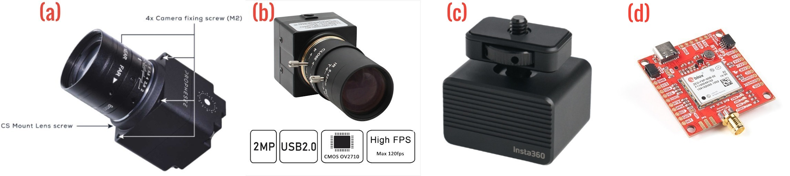

# NYC-Event-VPR: A Large-Scale High-Resolution Event-Based Visual Place Recognition Dataset in Dense Urban Environments 
[Taiyi Pan](http://www.taiyipan.org), Junyang He, [Chao Chen*](https://joechencc.github.io), [Yiming Li*](https://scholar.google.com/citations?user=i_aajNoAAAAJ), [Chen Feng](https://scholar.google.com/citations?user=YeG8ZM0AAAAJ)

New York University, Tandon School of Engineering

## Abstract 


Visual place recognition (VPR) enables autonomous robots to identify previously visited locations, which contributes to tasks like simultaneous localization and mapping (SLAM). VPR faces challenges such as accurate image neighbor retrieval and appearance change in scenery.

Event cameras, also known as dynamic vision sensors, are a new sensor modality for VPR and offer a promising solution to the challenges with their unique attributes: high temporal resolution (1MHz clock), ultra-low latency (in μs), and high dynamic range (>120dB). These attributes make event cameras less susceptible to motion blur and more robust in variable lighting conditions, making them suitable for addressing VPR challenges. However, the scarcity of event-based VPR datasets, partly due to the novelty and cost of event cameras, hampers their adoption.

To fill this data gap, our paper introduces the NYC-Event-VPR dataset to the robotics and computer vision communities, featuring the Prophesee IMX636 HD event sensor (1280x720 resolution), combined with RGB camera and GPS module. It encompasses over 13 hours of geotagged event data, spanning 260+ kilometers across New York City, covering diverse lighting and weather conditions, day/night scenarios, and multiple visits to various locations.

Furthermore, our paper employs the VPR-Bench framework to conduct generalization performance assessments, promoting innovation in event-based VPR and its integration into robotics applications.

## Links
Dataset repository: https://huggingface.co/datasets/ai4ce/NYC-Event-VPR      
Paper website: https://ai4ce.github.io/NYC-Event-VPR/

## Dataset 
### Coverage 
      
Total coverage over New York City     

### Visualization 
      
Visualizations (left column: naively rendered; middle column: E2VID reconstructed; right column: RGB images)     

### Sensors 
             
Sensors (a: Prophesee EVK4 HD event camera, b: ELP RGB camera, c: Insta360 vibration damper, d: Sparkfun RTK-GPS-SMA breakout board)      

## Instructions

### Prerequisites
- python 3 
- pandas 
- opencv-python 
- pickle 
- geopy 
- numpy 
- utm 
- matplotlib 
- descartes 
- geopandas 
- shapely 
- torch
- torchvision
- tqdm 
- kornia 

### Installation
1. Install Metavision SDK: https://docs.prophesee.ai/stable/installation/index.html   
   (Optional: only if working directly with raw sensor readings)         

2. Download repository 
    ```
    git clone https://github.com/ai4ce/NYC-Event-VPR.git
    ```
3. Install packages 
    ```
    pip install -r requirements.txt
    ```    
4. Install VPR-Bench: https://github.com/MubarizZaffar/VPR-Bench     
   (Optional: only if evaluating datasets with NYC-Event-VPR_VPR-Bench)      

5. Install Visual Geo-Localization: https://github.com/gmberton/deep-visual-geo-localization-benchmark      
   (Optional: only if training and evaluating datasets with NYC-Event-VPR_VG)

### Note 
NYC-Event-VPR_raw_data: Raw sensor readings collected in NYC. Contains raw event files, GPS coordinates and timestamps, and RGB images.      

NYC-Event-VPR_VG: preformatted datasets compatible with Visual Geo-localization framework.       

NYC-Event-VPR_VPR-Bench: preformatted datasets compatible with VPR-Bench.    

### Citation 
```bibtex

```

### Dataset structure 
```
NYC-Event-VPR
|
├── NYC-Event-VPR_raw_data
│   ├── sensor_data_2022-12-06_18-27-21
│   │   ├── data_2022-12-06_18-27-24.zip
│   │   ├── GPS_data_2022-12-06_18-27-22.csv
│   │   └── img_2022-12-06_18-27-22.zip
│   ├── sensor_data_2022-12-06_19-27-59
│   │   ├── data_2022-12-06_19-28-02.zip
│   │   ├── GPS_data_2022-12-06_19-28-00.csv
│   │   └── img_2022-12-06_19-28-00.zip
│   ├── sensor_data_2022-12-06_20-45-53
│   │   ├── data_2022-12-06_20-45-57.zip
│   │   ├── GPS_data_2022-12-06_20-45-55.csv
│   │   └── img_2022-12-06_20-45-55.zip
│   ├── sensor_data_2022-12-07_15-46-32
│   │   ├── data_2022-12-07_15-46-36.zip
│   │   └── GPS_data_2022-12-07_15-46-33.csv
│   ├── sensor_data_2022-12-07_16-52-55
│   │   ├── data_2022-12-07_16-52-58.zip
│   │   └── GPS_data_2022-12-07_16-52-55.csv
│   ├── sensor_data_2022-12-07_17-58-34
│   │   ├── data_2022-12-07_17-58-38.zip
│   │   └── GPS_data_2022-12-07_17-58-35.csv
│   ├── sensor_data_2022-12-09_13-59-10
│   │   ├── data_2022-12-09_13-59-13.zip
│   │   ├── GPS_data_2022-12-09_13-59-11.csv
│   │   └── img_2022-12-09_13-59-11.zip
│   ├── sensor_data_2022-12-09_14-41-29
│   │   ├── data_2022-12-09_14-41-32.zip
│   │   ├── GPS_data_2022-12-09_14-41-30.csv
│   │   └── img_2022-12-09_14-41-30.zip
│   ├── sensor_data_2022-12-09_18-56-13
│   │   ├── data_2022-12-09_18-56-16.zip
│   │   ├── GPS_data_2022-12-09_18-56-14.csv
│   │   └── img_2022-12-09_18-56-14.zip
│   ├── sensor_data_2022-12-09_19-40-27
│   │   ├── GPS_data_2022-12-09_19-40-28.csv
│   │   └── img_2022-12-09_19-40-28.zip
│   ├── sensor_data_2022-12-09_19-42-07
│   │   ├── data_2022-12-09_19-42-10.zip
│   │   ├── GPS_data_2022-12-09_19-42-08.csv
│   │   └── img_2022-12-09_19-42-08.zip
│   ├── sensor_data_2022-12-20_16-54-11
│   │   ├── data_2022-12-20_16-54-14.zip
│   │   ├── GPS_data_2022-12-20_16-54-12.csv
│   │   └── img_2022-12-20_16-54-12.zip
│   ├── sensor_data_2023-02-14_15-06-30
│   │   ├── data_2023-02-14_15-06-33.zip
│   │   ├── GPS_data_2023-02-14_15-06-31.csv
│   │   └── img_2023-02-14_15-06-31.zip
│   ├── sensor_data_2023-02-14_18-20-40
│   │   ├── data_2023-02-14_18-20-44.zip
│   │   ├── GPS_data_2023-02-14_18-20-42.csv
│   │   └── img_2023-02-14_18-20-42.zip
│   ├── sensor_data_2023-04-20_15-53-26
│   │   ├── data_2023-04-20_15-53-29.zip
│   │   ├── GPS_data_2023-04-20_15-53-27.csv
│   │   └── img_2023-04-20_15-53-27.zip
│   └── sensor_data_2023-04-20_17-10-01
│       ├── data_2023-04-20_17-10-04.zip
│       ├── GPS_data_2023-04-20_17-10-02.csv
│       └── img_2023-04-20_17-10-02.zip
|
├── NYC-Event-VPR_VG 
|   ├── NYC-Event-VPR_Event 
|   |   └── images 
|   |       ├── train
|   |       |   ├── queries.zip 
|   |       |   └── database.zip 
|   |       ├── val 
|   |       |   ├── queries.zip 
|   |       |   └── database.zip 
|   |       └── test 
|   |           ├── queries.zip 
|   |           └── database.zip 
|   ├── NYC-Event-VPR_E2VID
|   |   └── images 
|   |       ├── train
|   |       |   ├── queries.zip 
|   |       |   └── database.zip 
|   |       ├── val 
|   |       |   ├── queries.zip 
|   |       |   └── database.zip 
|   |       └── test 
|   |           ├── queries.zip 
|   |           └── database.zip 
|   └── NYC-Event-VPR_RGB
|       └── images 
|           ├── train
|           |   ├── queries.zip 
|           |   └── database.zip 
|           ├── val 
|           |   ├── queries.zip 
|           |   └── database.zip 
|           └── test 
|               ├── queries.zip 
|               └── database.zip 
|
└── NYC-Event-VPR_VPR-Bench
    ├── event_10m_0sobel_1fps
    │   ├── ground_truth_new.npy
    │   ├── query.zip
    │   └── ref.zip
    ├── event_25m_0sobel_1fps
    │   ├── ground_truth_new.npy
    │   ├── query.zip
    │   └── ref.zip
    ├── event_25m_0sobel_1fps_day
    │   ├── ground_truth_new.npy
    │   ├── query.zip
    │   └── ref.zip
    ├── event_25m_0sobel_1fps_night
    │   ├── ground_truth_new.npy
    │   ├── query.zip
    │   └── ref.zip
    ├── event_25m_100sobel_1fps
    │   ├── ground_truth_new.npy
    │   ├── query.zip
    │   └── ref.zip
    ├── event_2m_0sobel_1fps
    │   ├── ground_truth_new.npy
    │   ├── query.zip
    │   └── ref.zip
    ├── event_5m_0sobel_1fps
    │   ├── ground_truth_new.npy
    │   ├── query.zip
    │   └── ref.zip
    ├── reconstructed_25m_0sobel_1fps
    │   ├── ground_truth_new.npy
    │   ├── query.zip
    │   └── ref.zip
    ├── reconstructed_25m_0sobel_1fps_day
    │   ├── ground_truth_new.npy
    │   ├── query.zip
    │   └── ref.zip
    ├── reconstructed_25m_0sobel_1fps_night
    │   ├── ground_truth_new.npy
    │   ├── query.zip
    │   └── ref.zip
    ├── reconstructed_25m_60sobel_1fps
    │   ├── ground_truth_new.npy
    │   ├── query.zip
    │   └── ref.zip
    ├── reconstructed_2m_0sobel_1fps
    │   ├── ground_truth_new.npy
    │   ├── query.zip
    │   └── ref.zip
    ├── reconstructed_5m_0sobel_1fps
    │   ├── ground_truth_new.npy
    │   ├── query.zip
    │   └── ref.zip
    ├── rgb_15m_1fps
    │   ├── ground_truth_new.csv
    │   ├── ground_truth_new.npy
    │   ├── ground_truth.npy
    │   ├── query.zip
    │   └── ref.zip
    ├── rgb_25m_1fps
    │   ├── ground_truth_new.csv
    │   ├── ground_truth_new.npy
    │   ├── ground_truth.npy
    │   ├── query.zip
    │   └── ref.zip
    ├── rgb_2m_0sobel_1fps
    │   ├── ground_truth_new.npy
    │   ├── query.zip
    │   └── ref.zip
    ├── rgb_5m_0sobel_1fps
    │   ├── ground_truth_new.npy
    │   ├── query.zip
    │   └── ref.zip
    └── rgb_5m_1fps
        ├── ground_truth_new.csv
        ├── ground_truth_new.npy
        ├── ground_truth.npy
        ├── query.zip
        └── ref.zip    
```
